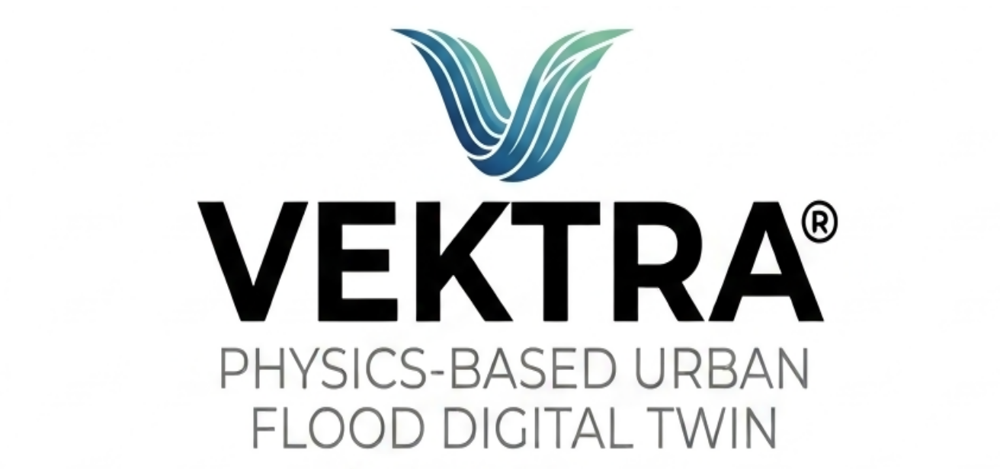

# VEKTRA



**VEKTRA** is a physics-based urban flood digital twin for exploring rainfall-driven
pluvial flooding in a three-dimensional representation of the built environment.

It combines real geospatial and meteorological observations, a physically grounded
reduced-complexity overland-flow model, a shared PostGIS data layer, and an
interactive 3D web interface.

> **Research software. Real data. Real simulation. Interactive digital twin.**

---

## What VEKTRA does

VEKTRA connects four components into one workflow:

```text
        REAL-WORLD DATA
              │
              ▼
   ┌──────────────────────┐
   │   Geospatial Data    │
   │                      │
   │ • OSM buildings      │
   │ • Terrain / DEM      │
   │ • Land characteristics│
   │ • Administrative AOI │
   │ • Meteorological data│
   └──────────┬───────────┘
              │
              ▼
   ┌──────────────────────┐
   │      PostGIS          │
   │  Shared spatial data  │
   │       layer           │
   └──────────┬───────────┘
              │
       ┌──────┴───────┐
       ▼              ▼
┌─────────────┐  ┌─────────────┐
│ Flood Engine│  │   Backend   │
│   WCA2D     │  │ Node + TS   │
│             │  │ REST API    │
└──────┬──────┘  └──────┬──────┘
       │                │
       └────────┬───────┘
                ▼
       ┌──────────────────┐
       │  VEKTRA Frontend │
       │                  │
       │ MapLibre + deck.gl│
       │                  │
       │ Rainfall calendar│
       │ 3D buildings     │
       │ Flood depth      │
       │ Arrival time     │
       │ Duration         │
       │ Temporal control │
       └──────────────────┘
