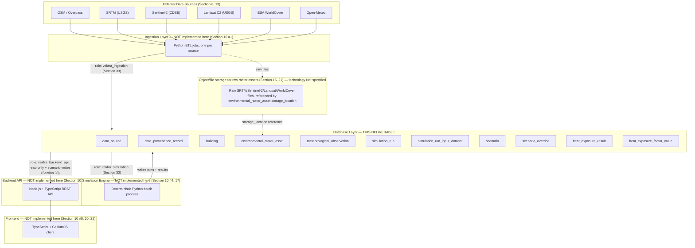

# VEKTRA Database Layer — Architectural Context

This diagram shows where the database layer (this `db/` directory) sits within VEKTRA's overall architecture, per EDD Section 9 (High-Level Architecture) and Section 7 (Modularity). It documents context only — nothing outside `db/` has been implemented as part of this task; ingestion, simulation, backend, and frontend remain out of scope here.

## Layer boundaries this schema enforces (Section 9)

- **Ingestion depends on nothing downstream.** It only ever writes to `data_source`, `data_provenance_record`, `building`, `environmental_raster_asset`, `meteorological_observation` (see `vektra_ingestion` grants, migration `0014`).
- **Simulation depends only on canonical storage**, never on the API or frontend (Section 9: "The simulation engine depends only on canonical storage, never on the API or frontend"). It reads canonical + scenario tables and writes `simulation_run`, `simulation_run_input_dataset`, `heat_exposure_result`, `heat_exposure_factor_value` (`vektra_simulation` grants).
- **The API layer depends on canonical and derived storage, never directly on external data sources** (Section 9). It is read-only except for scenario creation (FR-8), matching `vektra_backend_api` grants.
- **No path allows the frontend, API layer, or scenario subsystem to write to building geometry** (Section 11). Enforced structurally: no role other than `vektra_ingestion` has `INSERT`/`UPDATE` on `building`, and the `trg_building_no_update` trigger blocks all updates regardless of role (migration `0005`).

## Explicitly out of scope for this task

Per the instructions this schema was built under: no frontend code, no Cesium integration, no API code, no simulation code, and no ingestion code were written. Only the database layer (`db/`) was implemented.
