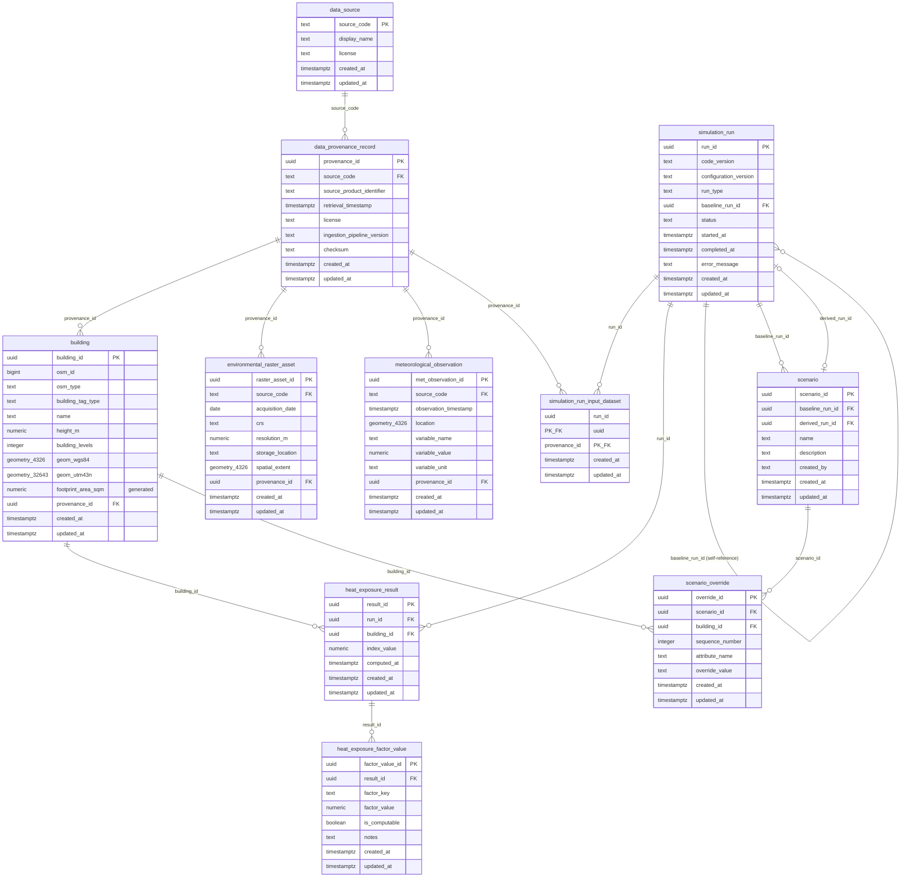

# VEKTRA — Entity-Relationship Diagram

Reflects `db/schema.sql` / `db/migrations/0001`–`0014`. EDD reference: Section 16 (Database Conceptual Model).

## Reading notes

- `geometry_4326` / `geometry_32643` denote PostGIS `geometry(...)` columns constrained to that SRID by a `CHECK (ST_SRID(...) = ...)` constraint — Mermaid's ER syntax has no native spatial type, so this is a documentation convention, not a literal column type name.
- `simulation_run.baseline_run_id` is self-referential: a scenario-type run points back at the baseline run it was derived from (Section 11).
- `scenario` has two independent links to `simulation_run`: `baseline_run_id` (the run it overlays, required at creation) and `derived_run_id` (the run its execution produced, NULL until executed) — see Section 16, "a Scenario references exactly one baseline SimulationRun and produces exactly one derived SimulationRun."
- There is deliberately no `dataset_version` entity. `data_provenance_record` fulfills that role (Section 27), and `simulation_run_input_dataset` is the many-to-many join recording which dataset versions a given run consumed (FR-12). Full rationale in `db/README.md`.
